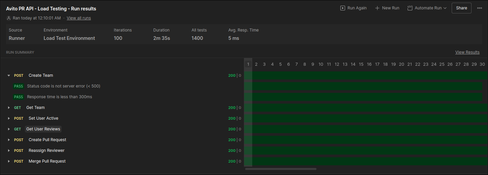

# Avito PR API

Сервис для автоматического назначения ревьюеров на Pull Request'ы.

## Запуск

Перед запуском убедитесь, что в корневой директории проекта есть файл `.env`. Пример конфигурации можно найти в `.env.example`.

### Локальный запуск приложения (через docker-compose)
1. Клонирование репозитория
```bash
git clone github.com/nedokyrill/avito-pr-api
```
2. Запуск приложения
```bash
make docker-up
```

После выполнения этой команды у вас соберутся все необходимые образы и поднимутся следующие контейнеры:

| Сервис          | Имя контейнера           | Доступный порт на хосте            |
|-----------------|--------------------------|------------------------------------|
| Основной API    | avito-pr-api-backend     | localhost:8080                     |
| PostgreSQL      | avito-pr-api-postgres    | localhost:5432                     |
| Migrate         | avito-pr-api-migrate     | (падает после выполнения миграций) |
| Prometheus      | avito-pr-api-prometheus  | localhost:9090                     |

Миграции применяются автоматически при запуске через контейнер `migrate`.

3. Остановка всех контейнеров с удалением volumes
```bash
make docker-up
```

### Локальный запуск приложения
1. Применение миграций
```bash
make migrate-up
```
2. Запуск приложения
```bash
make run
```
## Реализация

### 1.  Для проверки токенов создан **middleware-заглушка**, который можно переписать для проверки ролей пользователей. **В заголовке `Authorization` необходимо передавать токен для эндпоинтов, требующих авторизации**. 

2. В данном проекте использована библиотека **Gin** для работы с HTTP сервером, **Zap** для структурированного логирования серверных ошибок. Типы для API сгенерированы из OpenAPI спецификации с помощью `oapi-codegen`.

3. Контексты из HTTP запроса передаются вниз по всем слоям архитектуры. Для подключения к БД используется контекст с таймаутом для предотвращения зависаний.

4. Для оптимизации запросов к БД добавлена **индексация таблиц** на часто используемые поля.

5. Реализован паттерн **graceful shutdown** для корректного завершения работы сервера при получении сигналов прерывания.

6. Написаны **юнит тесты** для сервисного и storage слоёв, а также для технических методов из пакета `utils`. Покрытие тестами составляет минимум 75% для всех слоёв.

Для запуска юнит тестов:
```bash
make tests
```


## Дополнительные задания

1. ✅ **Эндпоинт статистики** — добавлена метрика `pr_lifecycle_duration_hours` в Prometheus, которая отслеживает время жизни PR от создания до мерджа в часах. Метрика доступна на эндпоинте `/metrics`.

   Примеры PromQL запросов:
   ```promql
   # Среднее время жизни PR (за последние 5 минут)
   rate(pr_lifecycle_duration_hours_sum[5m]) / rate(pr_lifecycle_duration_hours_count[5m])
   ```

   ```promql
   # 95-й перцентиль времени жизни PR (p95)
   histogram_quantile(0.95, rate(pr_lifecycle_duration_hours_bucket[5m]))
   ```

2. ✅ **Массовая деактивация пользователей команды** — эндпоинт `POST /users/deactivateTeamMembers` (логику работы можно
прочитать в комментариях к файлу /internal/servises/userService/deactivate_team_members.go):
   Пример запроса:
   ```bash
   POST /users/deactivateTeamMembers
   Authorization: Bearer <token>
   Content-Type: application/json

   {
     "team_name": "backend",
     "user_ids": ["user-1", "user-2"]
   }
   ```

3. ✅ **Интеграционное тестирование** — тест `TestIntegrationPullRequestFlow` проверяет полный флоу работы с PR:
   - Создание команды
   - Создание пользователей (автор + ревьюверы, включая неактивного)
   - Создание PR
   - Назначение ревьюеров (проверка, что автор и неактивный пользователь не назначены)
   - Мердж PR с проверкой изменения статуса и заполнения `merged_at`
   - Проверка идемпотентности merge (повторный вызов не приводит к ошибке)
   - Проверка cascade delete (удаление команды удаляет связанных пользователей и PR)

   Команда для запуска (использует контейнер с постгресом, поэтому перед запуском нужно освободить 5432 порт):
   ```bash
   make integration-tests
   ```

4. ✅ **Нагрузочное тестирование** — провел нагрузочное тестирование через Postman.

   **Результаты:**
   - Минимальное время ответа: 2 мс
   - Максимальное время ответа: 11 мс
   - Среднее время ответа: 5 мс
   - Успешность запросов (2хх или 4хх): 100%
   

5. ✅ **Конфигурация линтера** — настроен `golangci-lint` с конфигурационным файлом `.golangci.yml` (пояснения к 
файлу можно прочитать в комментариях к нему).

   Команда для запуска:
   ```bash
   make lint
   ```

  
## Вопросы и решения

### 1. Флаг `need_more_reviewers`

В условии сказано, что у PR есть флаг `need_more_reviewers`, но в API спецификации и ТЗ не указано, что с ним делать. 

**Что сделал:** Этот флаг у PR по умолчанию `false`, становится `true` когда не хватает ревьюеров при `reassignedReviewers` или создании PR. Это позволяет клиенту понять, что PR создан, но для него не хватило доступных ревьюверов.


### 2. Уникальные идентификаторы для PR

В некоторых эндпоинтах передаётся только ID PR, что может привести к путанице, если ID не уникальны (например: /pullRequest/merge)

**Что сделал:** Сделал id для PR уникальным (primary key).
